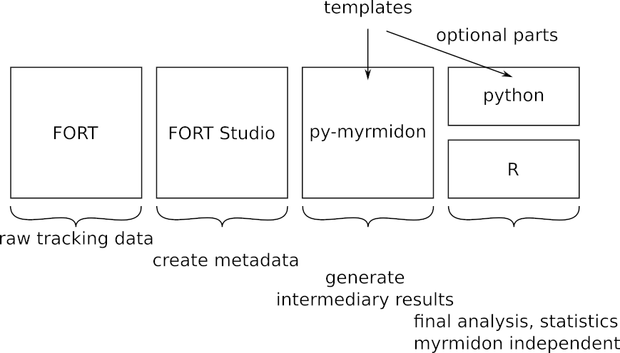

# data-analysis-templates

This repository contains a collection of standard data analysis scripts
using `py-fort-myrmidon` and is intended as a starting point for users
without a profound knowledge of python and as a collection of best practice
examples. The scripts show sample usages of the `py-fort-myrmidon` library
and some additional tools. The `py-fort-myrmidon` documentation is located
[here](https://formicidae-tracker.github.io/myrmidon). All scripts requires
preprocessed tracking data, i.e. the output of `fort-studio`. Some example
preprocessed data can be found
[here](https://drive.switch.ch/index.php/s/a9MpQljSBcKagCl).


Each notebook has a first part in which standard intermediary data is
produced, such as interaction network graph edgelists or spatial
fidelity maps. This data is typically lightweight and can be exported,
e.g. in csv format, for the use with other, myrmidon independent
software. Alternatively, it can be further analyzed in python as
outlined in the optional parts of the notebooks.



## How to Reproduce the Notebooks

If you want to play with these notebooks yourself, you can proceed as
follow, once you cloned this repository.

1. Create the `conda` environment

The use of [mamba](https://github.com/mamba-org/mamba) is strongly recommended.

```bash
mamba env create -f conda-environments/myrmidon-analysis.yml
```

2. Download the example dataset and metadata

```bash
wget https://drive.switch.ch/index.php/s/a9MpQljSBcKagCl/download -O fort-dataset-example.zip
unzip fort-dataset-example.zip
```

3. Starts `jupyter`

```bash
conda activate myrmidon-analysis
jupyter lab
```
